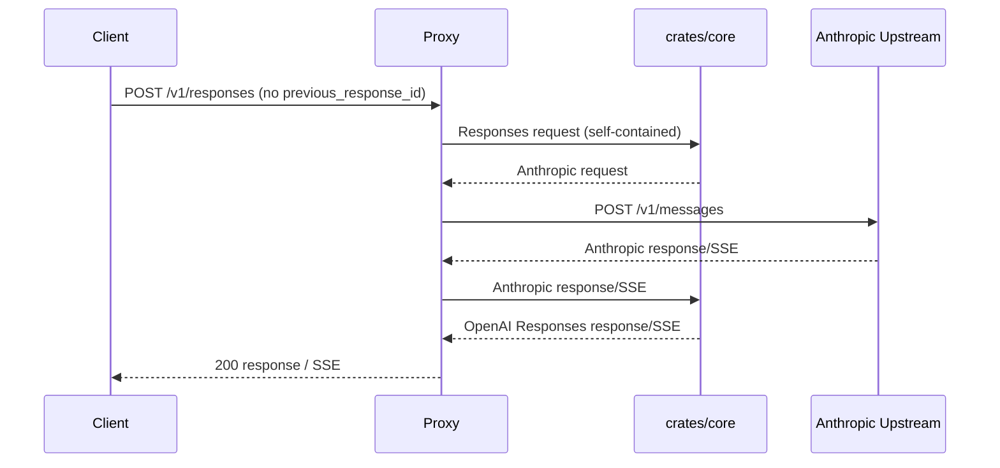
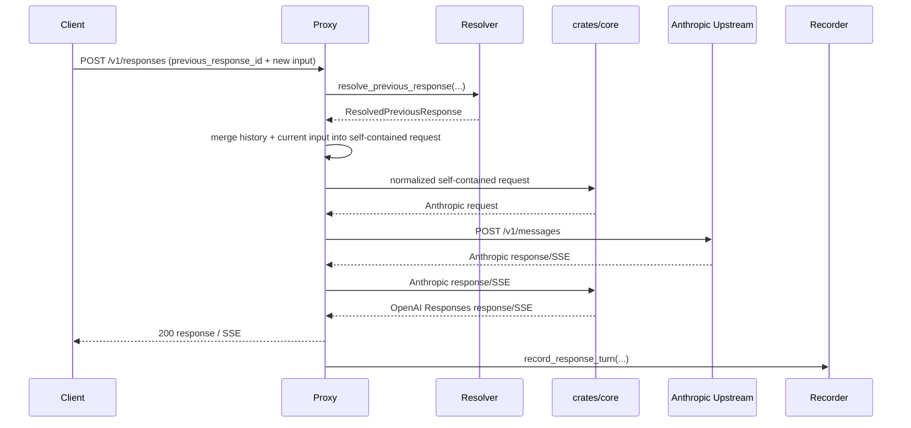
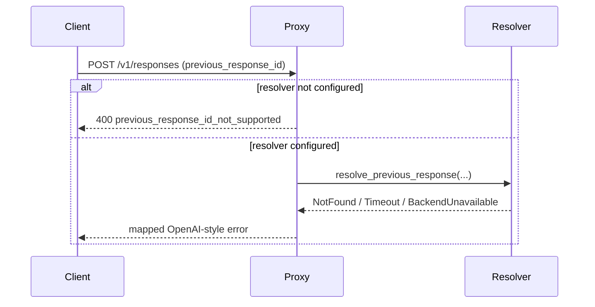

# 13 — Responses `previous_response_id` Interface Design

Status: draft v1 · Owner: TBD · Depends on: [10-protocol-transform-design.md](./10-protocol-transform-design.md), [63-http-proxy-example.md](./63-http-proxy-example.md), [99-protocol-transform-key-decisions.md](./99-protocol-transform-key-decisions.md)

## 1. Purpose

定义 `OpenAI Responses API` 中 `previous_response_id` 的**接口级兼容方案**，明确：

- `llm-bridge` 对外如何接受该字段；
- 状态恢复属于哪一层；
- 在**不实现 store** 的前提下，如何为后续扩展保留稳定接口。

本文档**不**要求当前实现任何内存/文件/数据库/Redis store。

## 2. Decision summary

- `previous_response_id` 的状态恢复能力属于 **proxy/caller layer**，**不属于** `crates/core` transform。
- `crates/core` 继续保持**无状态**：只接受已经补全上下文的请求，并执行协议转换。
- 当前阶段只定义两个扩展接口：
  - **Resolver**：按 `previous_response_id` 取回历史上下文；
  - **Recorder**：把新一轮请求/响应写给外部状态提供方。
- 如果客户端传入 `previous_response_id`，但宿主没有绑定 `Resolver`，bridge 必须**显式报错**，不能静默忽略。

## 3. Goals / non-goals

### 3.1 Goals

- 为 `/v1/responses` 保留未来可扩展的续聊接口。
- 保持 `crates/core` 的纯转换职责不变。
- 让未来的内存态 / 外部服务态 / 持久化态实现共享同一接口契约。
- 对客户端暴露稳定、可解释的错误语义。

### 3.2 Non-goals

- 不在当前阶段实现任何 store。
- 不在当前阶段实现会话分叉管理、压缩、TTL、GC。
- 不在当前阶段支持“仅凭 `previous_response_id` 自动恢复所有历史”的实际运行能力。
- 不修改 Anthropic 上游协议以引入 provider 私有状态字段。

## 4. Layering

| Layer | Responsibility |
| --- | --- |
| Client-facing `/v1/responses` API | 接收 `previous_response_id`、返回 OpenAI 风格结果或错误 |
| Proxy / caller layer | 决定是否调用 `Resolver` / `Recorder`，并把历史补全成自包含请求 |
| `crates/core` transform | 只做 `Responses/OpenAI/Anthropic` 协议转换，不持久化状态 |
| External state provider | 由宿主注入；可以是未来的内存态、Redis、SQL、远程服务 |

该分层受 [10 §2.3](./10-protocol-transform-design.md#23-consumption-model) 与 [99 §D6](./99-protocol-transform-key-decisions.md) 约束：core 不承担 server/session 状态责任。

## 5. Client-visible behaviour

### 5.1 No `previous_response_id`

- 按当前无状态 `/v1/responses` 路径处理。
- 请求必须是**自包含**的；bridge 不推断任何隐式历史。

### 5.2 `previous_response_id` is present

- Proxy / caller layer 必须尝试调用 `Resolver`。
- `Resolver` 返回历史后，proxy 将历史与本轮输入合并成**自包含上下文**，再交给 core transform。
- 如果没有绑定 `Resolver`，请求必须失败，而不是 silently ignore。

### 5.3 Error contract

| Case | HTTP | OpenAI-style error code | Behaviour |
| --- | --- | --- | --- |
| 配置了 `previous_response_id`，但未绑定 `Resolver` | `400` | `previous_response_id_not_supported` | 明确告诉客户端当前 deployment 不支持续聊恢复 |
| 绑定了 `Resolver`，但查不到该 id | `404` | `previous_response_id_not_found` | 明确告诉客户端引用的上文不存在 |
| `Resolver` 超时 / 外部状态服务失败 | `504` / `502` | `previous_response_id_resolution_failed` | 保持错误可诊断，不回退成空上下文 |
| `Resolver` 返回的历史超出限制 | `413` | `resolved_context_too_large` | 按边界拒绝 |

### 5.4 Explicit contract for stateless callers

如果调用方希望继续保持纯无状态模式，必须：

- **省略** `previous_response_id`；
- 在当前请求中显式重发所需历史上下文。

换言之，`previous_response_id` 一旦出现，就表示调用方选择了“由 bridge 宿主解析历史”的路径。

### 5.5 Error response JSON examples

以下示例用于冻结**客户端可见**错误语义；字段名优先保持 `OpenAI` 风格简单错误对象。

#### `previous_response_id_not_supported`

```json
{
  "error": {
    "message": "This deployment does not support previous_response_id resolution.",
    "type": "invalid_request_error",
    "code": "previous_response_id_not_supported",
    "param": "previous_response_id"
  }
}
```

#### `previous_response_id_not_found`

```json
{
  "error": {
    "message": "The referenced previous_response_id was not found.",
    "type": "invalid_request_error",
    "code": "previous_response_id_not_found",
    "param": "previous_response_id"
  }
}
```

#### `previous_response_id_resolution_failed`

```json
{
  "error": {
    "message": "Failed to resolve previous_response_id from the configured state provider.",
    "type": "api_error",
    "code": "previous_response_id_resolution_failed",
    "param": "previous_response_id"
  }
}
```

#### `resolved_context_too_large`

```json
{
  "error": {
    "message": "The resolved conversation context exceeds deployment limits.",
    "type": "invalid_request_error",
    "code": "resolved_context_too_large",
    "param": "previous_response_id"
  }
}
```

#### `invalid_resolved_previous_response_state`

```json
{
  "error": {
    "message": "The resolved previous response state is invalid or incomplete.",
    "type": "api_error",
    "code": "invalid_resolved_previous_response_state",
    "param": "previous_response_id"
  }
}
```

## 6. Host integration interfaces

### 6.1 `ResponsesStateResolver`

用于读取 `previous_response_id` 对应的已知历史。

#### Contract

```rust
pub trait ResponsesStateResolver {
    async fn resolve_previous_response(
        &self,
        request: ResolvePreviousResponseRequest,
    ) -> Result<ResolvedPreviousResponse, ResolvePreviousResponseError>;
}
```

#### Request shape

```rust
pub struct ResolvePreviousResponseRequest {
    pub previous_response_id: String,
    pub current_model: String,
    pub current_instructions: Option<String>,
    pub current_input: serde_json::Value,
    pub current_tools: Vec<serde_json::Value>,
    pub current_tool_choice: Option<serde_json::Value>,
    pub trace_id: Option<String>,
    pub request_id: String,
}
```

字段约束：

- `previous_response_id` 不能为空。
- `current_input` 保留原始 `Responses` 形状，供 resolver 决定如何拼接历史。
- `current_tools` / `current_tool_choice` 原样透传给 resolver，避免 proxy 先做语义裁剪。
- `request_id` 用于日志、trace 与错误关联，不用于协议语义。

#### Response shape

```rust
pub struct ResolvedPreviousResponse {
    pub resolved_response_id: String,
    pub parent_response_id: Option<String>,
    pub conversation: NormalizedConversation,
    pub merge_strategy: MergeStrategy,
    pub metadata: std::collections::HashMap<String, String>,
}
```

其中：

- `resolved_response_id`：resolver 实际命中的 response id；允许未来做 alias / compaction。
- `conversation`：规范化后的历史上下文，不是 provider 原始 body。
- `merge_strategy`：指定 proxy 如何把历史与本轮输入合并。
- `metadata`：仅用于 observability / audit，不参与协议语义。

#### Error shape

```rust
pub enum ResolvePreviousResponseError {
    Unsupported,
    NotFound,
    Timeout,
    BackendUnavailable,
    ContextTooLarge,
    InvalidResolvedState,
}
```

映射要求：

- `Unsupported` -> `400 previous_response_id_not_supported`
- `NotFound` -> `404 previous_response_id_not_found`
- `Timeout` / `BackendUnavailable` -> `504` / `502 previous_response_id_resolution_failed`
- `ContextTooLarge` -> `413 resolved_context_too_large`
- `InvalidResolvedState` -> `502 invalid_resolved_previous_response_state`

### 6.2 `ResponsesStateRecorder`

用于在请求完成后把当前回合写给外部状态提供方。

#### Contract

```rust
pub trait ResponsesStateRecorder {
    async fn record_response_turn(
        &self,
        request: RecordResponseTurnRequest,
    ) -> Result<(), RecordResponseTurnError>;
}
```

#### Request shape

```rust
pub struct RecordResponseTurnRequest {
    pub response_id: String,
    pub parent_response_id: Option<String>,
    pub model: String,
    pub request_snapshot: NormalizedConversation,
    pub response_snapshot: NormalizedResponse,
    pub trace_id: Option<String>,
    pub request_id: String,
    pub created_at_unix_seconds: u64,
}
```

要求：

- `Recorder` 失败**不能**影响主请求成功响应；只允许记录 warning / error 日志。
- `Recorder` 看到的是规范化快照，而不是 provider-specific 原始请求体。
- `Recorder` 可以是 no-op；no-op 仍视为合法实现。

#### Error shape

```rust
pub enum RecordResponseTurnError {
    Timeout,
    BackendUnavailable,
    SerializationFailed,
}
```

这些错误只进入日志 / metrics，不改变客户端响应码。

### 6.3 Host wiring surface

宿主层推荐以可选依赖方式装配：

```rust
pub struct ResponsesStateHooks {
    pub resolver: Option<Arc<dyn ResponsesStateResolver>>,
    pub recorder: Option<Arc<dyn ResponsesStateRecorder>>,
}
```

语义：

- `resolver = None`：deployment 不支持 `previous_response_id` 恢复。
- `recorder = None`：deployment 不记录 response lineage，但不影响主流程。

## 7. Sequence diagrams

### 7.1 Stateless `/v1/responses` request



### 7.2 `previous_response_id` with resolver success



### 7.3 `previous_response_id` but resolver unavailable / lookup failed



## 8. Canonical handoff to core

Proxy / caller layer 在成功解析 `previous_response_id` 后，必须先把请求扩展为**自包含请求**，然后再进入 core。允许两种等价 handoff 形式：

1. 扩展成自包含的 `OpenAI Responses` 请求，再走 `Responses -> Anthropic`；
2. 直接扩展成 synthetic `OpenAI Chat` / `Anthropic Messages` 请求，再走现有 transform。

无论选择哪种形式，进入 `crates/core` 时都必须满足：

- 不再依赖外部 state provider 查询；
- 不再需要 `previous_response_id` 参与语义计算；
- 单次 transform 仍然是确定性的、无状态的。

### 8.1 Merge rule summary

Proxy / caller layer 在 resolver 成功返回后，必须先执行“历史 + 当前请求”的合并。推荐顺序如下：

1. 读取 resolver 返回的 `NormalizedConversation`；
2. 按 `MergeStrategy` 决定是**追加新 turn**还是**替换最后一个用户 turn**；
3. 将当前请求的 `instructions` 与历史 instructions 做一致性处理；
4. 将当前请求的 `input` 规范化为新的 `NormalizedTurn` 或新的 `NormalizedItem`；
5. 产出**完整自包含**的 conversation；
6. 再交给 core transform。

默认推荐：

- `instructions`：若当前请求显式给出，则以当前请求为准；
- `input`：作为**新的用户 turn**追加；
- 历史中的 assistant output / function call / function_call_output：全部保留。

### 8.2 Example: append current input as a new turn

#### Client request

```json
{
  "model": "qwen3.6-plus",
  "previous_response_id": "resp_prev_001",
  "input": "Now summarize the result in one sentence."
}
```

#### Resolver output (normalized)

```json
{
  "resolved_response_id": "resp_prev_001",
  "parent_response_id": null,
  "merge_strategy": "AppendCurrentInputAsNewTurn",
  "conversation": {
    "instructions": [
      { "role": "system", "text": "You are concise." }
    ],
    "turns": [
      {
        "turn_id": "turn_1",
        "role": "user",
        "items": [
          { "type": "input_text", "text": "Check the route /v1/responses." }
        ]
      },
      {
        "turn_id": "turn_2",
        "role": "assistant",
        "items": [
          { "type": "output_text", "text": "The route exists." }
        ]
      }
    ]
  }
}
```

#### Merged self-contained conversation

```json
{
  "instructions": [
    { "role": "system", "text": "You are concise." }
  ],
  "turns": [
    {
      "turn_id": "turn_1",
      "role": "user",
      "items": [
        { "type": "input_text", "text": "Check the route /v1/responses." }
      ]
    },
    {
      "turn_id": "turn_2",
      "role": "assistant",
      "items": [
        { "type": "output_text", "text": "The route exists." }
      ]
    },
    {
      "turn_id": "turn_3",
      "role": "user",
      "items": [
        { "type": "input_text", "text": "Now summarize the result in one sentence." }
      ]
    }
  ]
}
```

#### Resulting synthetic OpenAI Chat messages (one valid handoff form)

```json
[
  { "role": "system", "content": "You are concise." },
  { "role": "user", "content": "Check the route /v1/responses." },
  { "role": "assistant", "content": "The route exists." },
  { "role": "user", "content": "Now summarize the result in one sentence." }
]
```

### 8.3 Example: preserve tool loop before appending new input

#### Resolver output contains tool chain

```json
{
  "resolved_response_id": "resp_prev_tool_001",
  "merge_strategy": "AppendCurrentInputAsNewTurn",
  "conversation": {
    "instructions": [
      { "role": "system", "text": "You are a coding assistant." }
    ],
    "turns": [
      {
        "turn_id": "turn_1",
        "role": "user",
        "items": [
          { "type": "input_text", "text": "Find the responses route." }
        ]
      },
      {
        "turn_id": "turn_2",
        "role": "assistant",
        "items": [
          {
            "type": "function_call",
            "call_id": "call_1",
            "name": "find_route",
            "arguments_json": "{\"path\":\"/v1/responses\"}"
          }
        ]
      },
      {
        "turn_id": "turn_3",
        "role": "tool",
        "items": [
          {
            "type": "function_call_output",
            "call_id": "call_1",
            "output_text": "Found in crates/core/examples/http-proxy.rs"
          }
        ]
      },
      {
        "turn_id": "turn_4",
        "role": "assistant",
        "items": [
          { "type": "output_text", "text": "The route is implemented in the proxy example." }
        ]
      }
    ]
  }
}
```

#### Current request

```json
{
  "model": "qwen3.6-plus",
  "previous_response_id": "resp_prev_tool_001",
  "input": "Explain whether it already supports streaming."
}
```

#### Required merge outcome

合并后必须保留：

- 原始 user 请求
- assistant 的 function call
- tool 的 function call output
- assistant 对 tool output 的解释
- 当前新的 user input

不能把 tool loop 压扁成单条纯文本摘要，否则会破坏后续 agent/tool 语义。

### 8.4 Example: current request overrides instructions

如果 resolver 返回：

```json
{
  "conversation": {
    "instructions": [
      { "role": "system", "text": "You are concise." }
    ],
    "turns": []
  }
}
```

而当前请求显式给出：

```json
{
  "model": "qwen3.6-plus",
  "previous_response_id": "resp_prev_002",
  "instructions": "Answer in Chinese.",
  "input": "Summarize the last answer."
}
```

则默认推荐合并规则为：

- 采用当前请求的 `instructions = "Answer in Chinese."`
- 历史 turn 保留
- 当前 `input` 追加为新 turn

原因：`instructions` 是调用方在当前轮显式重新指定的高优先级上下文。

## 9. Normalized history shape

为避免把 provider-specific 形态直接耦合到状态接口，`Resolver` / `Recorder` 应围绕**规范化上下文**工作，而不是直接存某一家 provider 的原始 body。

### 9.1 Canonical conversation types

以下类型是**接口草案级 pseudo-Rust**，用于冻结字段语义，不要求当前仓库立刻按此名字实现。

```rust
pub struct NormalizedConversation {
    pub instructions: Vec<NormalizedInstruction>,
    pub turns: Vec<NormalizedTurn>,
}

pub struct NormalizedInstruction {
    pub role: NormalizedInstructionRole,
    pub text: String,
}

pub enum NormalizedInstructionRole {
    System,
    Developer,
}

pub struct NormalizedTurn {
    pub turn_id: String,
    pub role: NormalizedRole,
    pub items: Vec<NormalizedItem>,
}

pub enum NormalizedRole {
    User,
    Assistant,
    Tool,
}

pub enum NormalizedItem {
    InputText { text: String },
    OutputText { text: String },
    ReasoningText { text: String },
    FunctionCall { call_id: String, name: String, arguments_json: String },
    FunctionCallOutput { call_id: String, output_text: String },
}

pub struct NormalizedResponse {
    pub response_id: String,
    pub output: Vec<NormalizedItem>,
    pub output_text: String,
    pub model: String,
    pub usage: Option<NormalizedUsage>,
}

pub struct NormalizedUsage {
    pub input_tokens: u64,
    pub output_tokens: u64,
    pub total_tokens: u64,
}
```

### 9.2 Merge strategy

```rust
pub enum MergeStrategy {
    AppendCurrentInputAsNewTurn,
    ReplaceLastUserTurn,
}
```

当前推荐默认值为 `AppendCurrentInputAsNewTurn`，因为它最接近 `Responses` 的追加式续聊语义。

### 9.3 Why normalized shape is required

最小规范化单元必须至少能表达：

- system / developer instructions
- user input
- assistant text output
- assistant reasoning output（可选）
- function call
- function call output
- 轮次顺序与关联 id

这样未来无论上游最终是 Anthropic 还是其他 OpenAI-compatible surface，都能复用同一状态接口。

## 10. Compatibility and future evolution

- 未来如果实现内存 store、Redis、SQLite 或远程状态服务，只能作为 `Resolver` / `Recorder` 的不同实现。
- 未来如果要支持 response compaction、branching、TTL，也应扩展在 proxy/caller layer，不进入 `crates/core`。
- 当前客户端错误码与接口参数名应保持稳定，避免后续引入 store 时破坏 SDK 兼容性。
- 未来如果增加 capability discovery，也应暴露在 proxy API 层，例如通过配置或健康检查声明“是否支持 `previous_response_id` 解析”。

## 11. Capability declaration

deployment 应能明确声明自己是否支持 `previous_response_id` 解析，避免客户端只能“试错式”调用。

### 11.1 Requirements

- capability 声明必须位于 **proxy API layer**，不能下沉到 `crates/core`。
- capability 声明必须反映**当前 deployment wiring**，而不是抽象的理论能力。
- 若 `resolver = None`，则 capability 必须明确显示 `previous_response_id` 为 unsupported。

### 11.2 Recommended health / metadata shape

推荐在宿主已有的 health / metadata surface 上增加 capability 字段，而不是新增一套完全独立协议。

示例：

```json
{
  "status": "ok",
  "service": "llm-bridge",
  "capabilities": {
    "responses": {
      "supported": true,
      "previous_response_id": {
        "supported": false,
        "mode": "stateless_only"
      }
    }
  }
}
```

如果 deployment 已绑定 resolver，但 recorder 仍为 no-op，可以声明：

```json
{
  "status": "ok",
  "service": "llm-bridge",
  "capabilities": {
    "responses": {
      "supported": true,
      "previous_response_id": {
        "supported": true,
        "mode": "resolver_only"
      }
    }
  }
}
```

### 11.3 Capability modes

推荐把 `previous_response_id` 能力离散成以下模式：

| Mode | Meaning |
| --- | --- |
| `stateless_only` | 仅支持自包含 `/v1/responses` 请求；出现 `previous_response_id` 就报错 |
| `resolver_only` | 支持通过外部 resolver 读取历史；不保证写回 lineage |
| `resolver_and_recorder` | 同时支持读取历史与记录新 response lineage |

要求：

- capability mode 必须由宿主 wiring 自动推导，而不是手工文案配置；
- `resolver_only` 与 `resolver_and_recorder` 的差异只影响可观测性/后续续聊质量，不改变 core transform contract。

### 11.4 Client guidance

客户端若要可靠使用 `previous_response_id`，推荐先：

1. 查询 capability；
2. 确认 `previous_response_id.supported == true`；
3. 再发送带 `previous_response_id` 的 `/v1/responses` 请求。

若客户端不做 capability 预检查，也必须能正确处理本文定义的显式错误码。

## 12. Verification checklist

以下 checklist 用于未来真正实现该能力时的验证计划。

### 12.1 Capability surface

- [ ] 当 `resolver = None` 时，capability 返回 `supported: false` 与 `mode: stateless_only`
- [ ] 当仅绑定 resolver 时，capability 返回 `mode: resolver_only`
- [ ] 当 resolver + recorder 都绑定时，capability 返回 `mode: resolver_and_recorder`
- [ ] capability 不泄露 backend-specific secret / endpoint / credential 信息

### 12.2 Stateless request path

- [ ] 无 `previous_response_id` 的 `/v1/responses` 请求继续按当前无状态路径工作
- [ ] 无 `previous_response_id` 的流式请求继续按当前流式路径工作
- [ ] 引入 capability / hooks 后，不破坏既有 Chat Completions 路径

### 12.3 Resolver wiring and explicit failures

- [ ] 请求带 `previous_response_id` 且未绑定 resolver 时，返回 `400 previous_response_id_not_supported`
- [ ] resolver 返回 `NotFound` 时，返回 `404 previous_response_id_not_found`
- [ ] resolver 超时或 backend unavailable 时，返回 `502/504 previous_response_id_resolution_failed`
- [ ] resolver 返回超大上下文时，返回 `413 resolved_context_too_large`
- [ ] resolver 返回无效状态时，返回 `502 invalid_resolved_previous_response_state`
- [ ] 以上错误 body 与本文 JSON 示例保持一致

### 12.4 Merge correctness

- [ ] 普通文本历史能正确追加当前 user input
- [ ] 历史 tool loop（function call + function call output）不会被错误压扁为纯文本
- [ ] 当前请求显式给出 `instructions` 时，按设计覆盖历史 instructions
- [ ] `MergeStrategy::ReplaceLastUserTurn` 仅在明确要求时生效
- [ ] 合并后的请求进入 core 前已经完全自包含，不再依赖 resolver

### 12.5 Protocol conversion correctness

- [ ] 合并后的 self-contained request 能稳定转成 Anthropic `messages`
- [ ] Anthropic 非流式响应仍能正确回转为 OpenAI Responses response
- [ ] Anthropic SSE 仍能正确回转为 OpenAI Responses SSE
- [ ] tool call / tool result 的关联 id 在续聊后保持一致语义

### 12.6 Recorder behaviour

- [ ] recorder 成功时能记录当前 `response_id` 与 `parent_response_id`
- [ ] recorder 失败不会改变主请求成功响应
- [ ] recorder 失败会留下可观测日志 / metrics
- [ ] no-op recorder 仍是合法 deployment 形态

### 12.7 Safety and limits

- [ ] 解析出的上下文有明确大小上限
- [ ] tracing / logs 不泄露敏感 prompt、token、credential
- [ ] capability / error paths 不回显 backend-specific secrets
- [ ] 外部状态 provider 失败时不会 silently degrade 成空上下文继续请求

### 12.8 Regression coverage

- [ ] 不影响既有 `Anthropic <-> OpenAI Chat/Completions` 路径
- [ ] 不影响既有无状态 `/v1/responses` 路径
- [ ] 不把跨请求状态泄漏进 `crates/core`

## 13. Exit criteria for a future implementation phase

当后续真正实现该能力时，完成标准至少包括：

- `previous_response_id` 请求在绑定 `Resolver` 的 deployment 中可成功续聊；
- 未绑定 `Resolver` 时返回显式错误，而非静默降级；
- 历史中的 tool call / tool result 可正确恢复；
- `Recorder` 失败不会污染主请求成功路径；
- `crates/core` public API 不因 store 引入跨请求共享状态。

## 14. Cross-references

- ← Depends on: [10-protocol-transform-design.md](./10-protocol-transform-design.md), [63-http-proxy-example.md](./63-http-proxy-example.md)
- ↔ Related decisions: [99-protocol-transform-key-decisions.md](./99-protocol-transform-key-decisions.md)